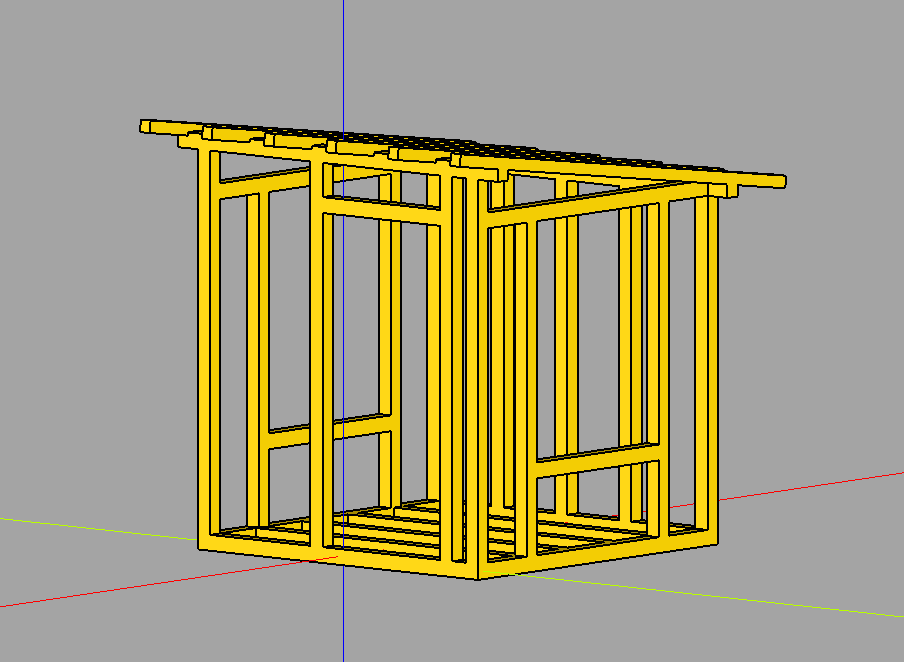
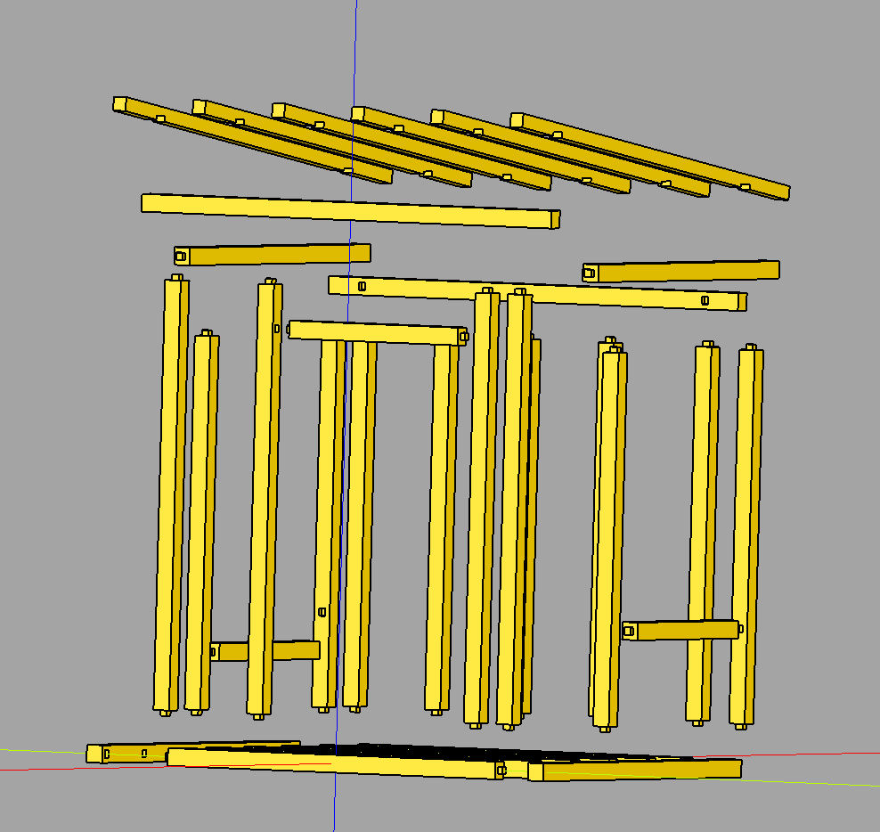
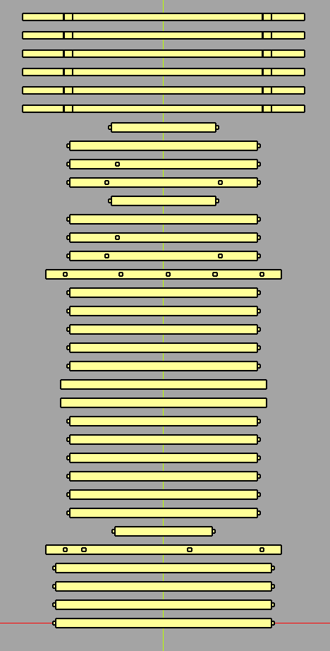

# Gartenhaus Project

This project generates a 3D model of a garden house using [CadQuery](https://cadquery.readthedocs.io/). It includes functionality to create various components of the house, such as walls, roof, and floor, and exports the resulting models and inventory data.

## Features

- **3D Modeling**: Generates 3D models of the garden house components.
- **Exploded View**: Creates an exploded view of the garden house for better visualization.
- **Inventory Management**: Outputs a JSON file with the inventory of parts used in the construction.
- **STEP File Export**: Exports the models in STEP format for use in CAD software.

## Visualizations

### Assembled Garden House


### Exploded View


### Parts Arranged in a Row


## Prerequisites

- Python 3.8 or higher
- [CadQuery](https://cadquery.readthedocs.io/)
- Docker (optional, for containerized execution)

## Running the Project

1. build docker image:
   ```bash
   make build
   ```
2. run the project:
   ```bash
   make run
   ```